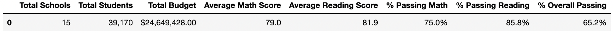
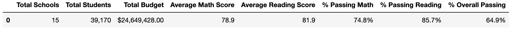
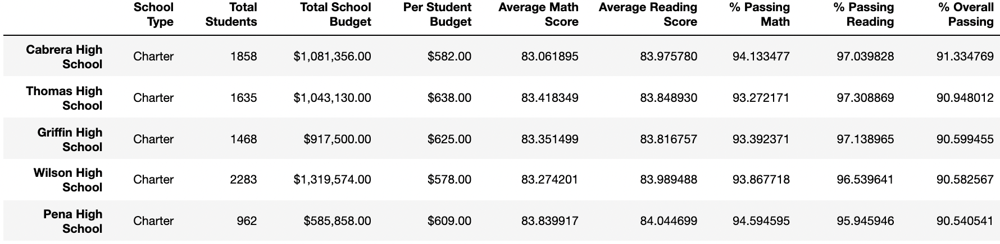
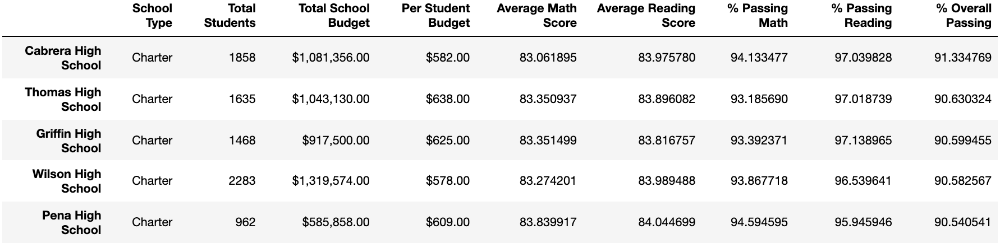
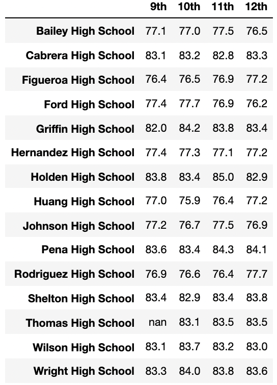
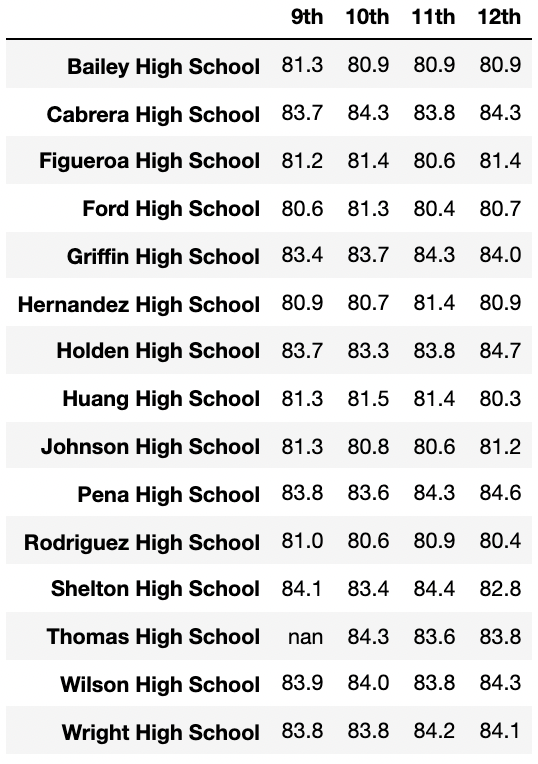
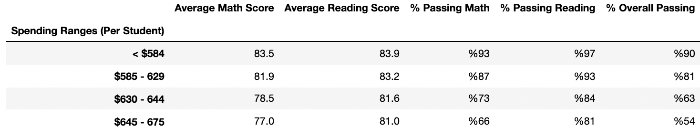
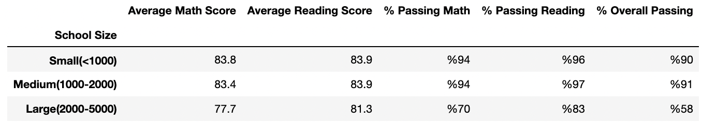
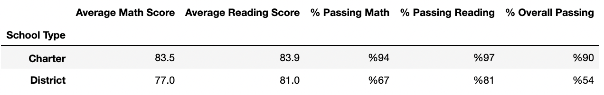

# Overview of the School District Analysis

## Overview of Project

In this analysis I supported Maria to analyze data from a variety of sources in a variety of formats of student scores from standardized tests in several schools. The data I analyzed is of 39,170 students from 15 schools where I used the Jupyter Notebook in Anaconda to run my code to analyze the data. The results of this analysis are intended to provide the School Board with insights regarding school performance, school budget, and school priorities. This analysis is done under the Family Educational Rights and Privacy Act (FERPA), respecting the privacy of the students in the data.  

### Objective 

I wanted to understand how changing the math and reading scores of students in Thomas High School will affect the district summary and the school summary, Thomas High School's relative performance to the other school's. Furthermore, I also delivered results regarding how the change in the scores affected math and reading scores by grade, school spending, school size and school type. With these indicators I concluded the implications of replacing math and reading scores of students in Thomas High School with NaN's.

## Results 

In this section I comparatively analyze the results when 9th grader math and reading scores were present and when they were replaced with NaN's. 

* **How is the district summary affected?** There is a realtively small difference in the results of the district summary. As can be inferred in table one compared to table two; excluding the math and reading scores of 9th graders from Thomas High School relatively decreases the results of the metrics. This implies that the scores of 9th graders from Thomas high school are high causing such a fall in the metrics, especially in math scores when they are excluded. 

 ***Table 1: District Summary without NaN replacement***
 
***Table 2: District Summary with NaN replacement***

* **How is the school summary affected?** In school summary the only thing that is affected is the results for Thomas High School. At first before removing 9th graders from the calculation is the % passing math, the % passing reading and the % overall passing which falls extremly low as can be seen in table 3. 

***Table 3: Thomas High School Before Number of Student Adjustment***

However, I adjust the number of students in my calculation by excluding the 9th graders in Thomas High School. The results of the adjustment can be seen in table 4. 

***Table 4: Thomas High School After Number of Student Adjustment***

When comparing this result with the adjustment to the first case when I didn't exclude 9th graders from the analysis as in table 5, I find a relatively small drop in the results with the adjustments.

***Table 5: Thomas High School Before Excluding 9th Graders***

* **How does replacing the ninth graders’ math and reading scores affect Thomas High School’s performance relative to the other schools?** In terms of Thomas High School's performance compared to other schools we don't see a change. Thomas High School is still ranked second according to the % overall passing values. Table 6 is when before excluding 9th grader scores and table 7 is after excluding 9th grader scores. 

***Table 6: Top Five Schools Before Excluding 9th Graders in Thomas High School***

***Table 7: Top Five Schools After Excluding 9th Graders in Thomas High School***

* **How does replacing the ninth-grade scores affect the following:**
	- ***Math and Reading Scores by Grade:*** The only values that are affected by the change is the value for the math and reading scores of 9th graders in which the values become equivalent to NaN.
	

	

	***Table 8: Average Math Scores by Grade***

	

	***Table 9: Average Reading Scores by Grade***
	
	- ***Scores by School Spending:*** Nothing changes the result in terms of categorizing district schools according to school spending. 
	
	
	
	***Table 10: Scores by School Spending***
	
	- ***Scores by School Size:*** Likewise, when replacing the math and reading scores of 9th graders with NaN's nothing changes in the values categorized according to school size. 
	
	
	
	- ***Scores by School Type:** Lastly, the changes in 9th grader scores didn't affect to results of scores by school type. 

	

# Summary

